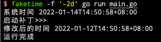

# gofaketime
通过monkey patch的方式修复libfaketime不适用于golang的问题；


### 前提
[libfaketime](https://github.com/wolfcw/libfaketime)


### 注意事项
1. 不能在权限管控严格的操作系统运行；如：macOS；
2. 需要结合libfaketime使用
3. 需要开启cgo功能;

```golang
package main

import (
	"time"

	"github.com/asppj/gofaketime"
)

func main() {
	println("系统时间", time.Now().Format(time.RFC3339))
	println("启动补丁>>>")
	faker := gofaketime.NewFakeTime()
	defer faker.Close()
	println("修改后的时间", time.Now().Format(time.RFC3339))
	println("运行完成")
}
```

### linux示例

